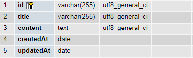

## React 仪表盘 — "[同构](http://nerds.airbnb.com/isomorphic-javascript-future-web-apps/)" 管理仪表盘模板
基于 [React](https://facebook.github.io/react/)、[Bootstrap](http://getbootstrap.com/)、[React Router](https://reacttraining.com/react-router/)、
[Redux](http://redux.js.org/) 和 [GraphQL](http://graphql.org/) 构建，基于
[Create React App](https://github.com/facebook/create-react-app) 和最新的行业最佳实践。

[查看演示](https://flatlogic.com/admin-dashboards/react-dashboard/demo) | [下载](https://github.com/flatlogic/react-dashboard.git) | [更多模板](https://flatlogic.com/templates) | [支持论坛](https://flatlogic.com/forum)

[](https://flatlogic.com/admin-dashboards/react-dashboard/demo)

这个种子项目类似于在 [Themeforest](https://themeforest.net/category/site-templates/admin-templates) 或 [Wrapbootstrap](https://wrapbootstrap.com/themes/admin) 上可以找到的模板的免费版本，具有工作后的端集成，帮助你开始下一个 [商业软件](https://flatlogic.com/) 开发。

## 功能
* React
* 移动友好布局（响应式）
* React Router
* Bootstrap3
* GraphQL
* Nodejs 后端集成
* Sass 样式
* 精美的、干净的、响应式布局
* 许多实用 CSS 类，用于快速开发（flatlogic CSS 集合）
* 认证
* CRUD 操作示例

## 快速开始

#### 1. 获取最新版本

你可以通过运行以下命令在你的本地机器上克隆 React Dashboard 的最新版本：

```shell
$ git clone -o react-dashboard -b master --single-branch \
      https://github.com/flatlogic/react-dashboard.git MyApp
$ cd MyApp
```

#### 2. 运行 `yarn install`

此命令将安装 [package.json](../package.json) 文件中列出的运行时项目依赖项和开发工具。

#### 3. 运行 `yarn dev`

此命令将同时启动应用和 express 服务器，设置你的数据库，启动本地服务器 XAMPP、opensever 或其他工具来启动数据库，在文件 
```shell
src > data > sequelize.js.
```
中连接到它。然后转到  
```shell
src > data > schema.js 
```
并启用变更。这种准备工作
将使你能够在本地实现 CRUD 操作。

### 4. 如何创建数据库

创建数据库。例如，将其命名为 "sequelize" 并向其中添加 posts 表，你的表应具有与屏幕截图上所示相同的结构
<br>


> [http://localhost:3000/](http://localhost:3000/) — Node.js 服务器<br>
> [http://localhost:3000/graphql](http://localhost:3000/graphql) — GraphQL 服务器和 IDE<br>

现在你可以打开你的网页应用在浏览器、移动设备上，并开始
 hacking。每当你在 `/src` 文件夹内的任何源文件中进行修改时，
模块打包器 ([Webpack](http://webpack.github.io/)) 将会实时重新编译应用并刷新所有连接的浏览器。

有关更多信息，请参考 [入门指南](./docs/getting-started.md) 下载并运行项目（Node.js >= 6.5）

## 支持
有关任何其他信息，请访问我们的 [**支持论坛**](https://flatlogic.com/forum) 并在那里提出你的问题或反馈。我们非常感谢你的参与！

## 如何支持开发者？
- 给我们的 GitHub 仓库加星标 :star:
- [在 Twitter 上分享](https://twitter.com/intent/tweet?text=Amazing%20dashboard%20built%20with%20NodeJS,%20React%20and%20Bootstrap!&url=https://github.com/flatlogic/react-dashboard&via=flatlogic)。
- 创建拉取请求，提交错误，建议新功能或文档更新 :wrench:
- 关注 [@flatlogic on Twitter](https://twitter.com/flatlogic)。
- 订阅 Flatlogic newsletter 在 [flatlogic.com](https://flatlogic.com/)
- 在 [Facebook](https://www.facebook.com/flatlogic/) 上点赞 :thumbsup:

## 预付费主题
寻找预付费主题和模板？查看更多 [admin 仪表盘模板在 flatlogic.com](https://flatlogic.com/admin-dashboards)。

## 许可证

[MIT](https://github.com/flatlogic/react-dashboard/blob/master/LICENSE.txt) 和 RSK 的另一个 [MIT](https://github.com/flatlogic/react-dashboard/blob/master/LICENSE-react-starter-kit.txt) 许可证。

```
